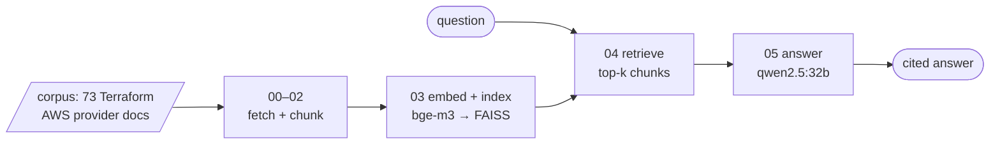

# RAG Pipeline over AWS Docs — local first, AWS later

A retrieval-augmented generation (RAG) pipeline that answers questions about
AWS infrastructure using the Terraform AWS provider documentation as its
knowledge base. Ask *"how do I enable versioning on an S3 bucket?"* and get an
answer grounded in — and cited against — the actual docs.

The build has two deliberate phases:

1. **Local prototype (this repo, in progress)** — runs entirely on my machine
   for $0: [Ollama](https://ollama.com) for embeddings + generation, FAISS for
   vector search. Every component is chosen so it has a 1:1 AWS counterpart.
2. **AWS port (next)** — the same pipeline rebuilt with Terraform on managed
   services: Bedrock, S3 Vectors, Lambda.

I'm building this to learn RAG from first principles and as preparation for
the AWS Data Engineer Associate (DEA-C01) path — which is why the corpus is
AWS docs and why every local piece maps onto an AWS service.

## Architecture



| Pipeline stage | Local (this repo) | AWS port |
|---|---|---|
| Ingest corpus | `00_fetch_corpus.py` | S3 raw bucket |
| Chunk documents | `02_chunk.py` (structure-aware) | Lambda |
| Embed text (1024-dim) | Ollama `bge-m3` | Bedrock Titan Embeddings v2 |
| Vector index + search | FAISS | S3 Vectors |
| Generate cited answer | Ollama `qwen2.5:32b` | Bedrock Claude (Converse API) |
| Provision it all | — | Terraform |

`bge-m3` was picked because it produces **1024-dimensional vectors — the same
as Titan Embeddings v2**, so the index schema survives the port unchanged.

## Tasks

Each task is one runnable script plus a study write-up
(`NN_name_explained.md`: concepts → code walkthrough → real output → AWS
mapping).

| # | Script | What it does | Status |
|---|---|---|---|
| 0 | [`00_fetch_corpus.py`](local/00_fetch_corpus.py) | Download the 73-doc corpus, pinned to provider v6.53.0 | ✅ |
| 1 | [`01_embed_probe.py`](local/01_embed_probe.py) | Text → 1024-dim vector; build cosine-similarity intuition | ✅ |
| 2 | [`02_chunk.py`](local/02_chunk.py) | Structure-aware chunking → 893 chunks with metadata (`chunks.jsonl`) | ✅ |
| 3 | `03_index.py` | Batch-embed all chunks → FAISS index + metadata sidecar | next |
| 4 | `04_retrieve.py` | Question → top-k most relevant chunks | todo |
| 5 | `05_answer.py` | Top-k chunks + question → grounded, cited answer | todo |

## Running it

Prerequisites: [uv](https://docs.astral.sh/uv/) and [Ollama](https://ollama.com)
with the two models pulled:

```bash
ollama pull bge-m3        # embeddings (~1.2 GB)
ollama pull qwen2.5:32b   # generation, Task 5 (~20 GB; any qwen2.5 size works)
```

Then, from the repo root:

```bash
uv sync                                   # create .venv with numpy + faiss-cpu
uv run python local/00_fetch_corpus.py    # download the corpus (~740 KB)
uv run python local/01_embed_probe.py     # Task 1: embedding intuition
uv run python local/02_chunk.py           # Task 2: build chunks.jsonl
```

Task 1's output, verbatim — the core idea of the whole project in four lines:

```
cosine similarity (higher = more similar in MEANING)
  A vs B  (both streaming)  = 0.471   <- expect HIGHEST
  A vs C  (stream vs recipe)= 0.356
  B vs C  (stream vs recipe)= 0.347
```

A ("Kinesis Data Streams ingests real-time event data") and B ("Firehose
delivers streaming records into an S3 bucket") share almost no words, yet
score highest — retrieval works on meaning, not keyword overlap.

## Design decisions

- **Corpus and derived data stay out of git.** The docs are HashiCorp's, not
  mine (see licensing below), and `chunks.jsonl` is a pure function of corpus +
  chunker. Both are reproduced exactly by running tasks 0 and 2 — code in git,
  data from a pinned source.
- **Version-pinned ingestion.** The provider releases weekly; the fetch script
  pins tag `v6.53.0` so every clone chunks and indexes identical bytes
  (verified byte-for-byte against upstream).
- **Structure-aware chunking over fixed windows.** Chunks follow the docs'
  heading/section structure, so no chunk mixes unrelated resources. Trade-off:
  short doc sections drag mean chunk size to ~174 tokens (target was 500–800).
  Deliberately deferred: measure retrieval quality at Task 4 first; if it
  suffers, merge tiny neighboring sections (~100-token minimum) rather than
  guess now.

## Corpus source & licensing

The corpus is the resource documentation of the
[terraform-provider-aws](https://github.com/hashicorp/terraform-provider-aws)
project, © HashiCorp, licensed [MPL-2.0](https://github.com/hashicorp/terraform-provider-aws/blob/main/LICENSE)
— 73 pages covering the S3, Glue, Kinesis, Lambda, DynamoDB, Athena, KMS and
Step Functions resources. The docs are **not redistributed in this repo**;
`local/00_fetch_corpus.py` downloads them from HashiCorp's repository at a
pinned release tag.

## Study notes

The `_explained.md` series is where the learning lives — one per task:
[fetching & reproducibility](local/00_fetch_corpus_explained.md) ·
[embeddings & cosine similarity](local/01_embed_probe_explained.md) ·
[chunking strategies](local/02_chunk_explained.md).
The full build plan, including the AWS port phases, is in
[`Project_Guide_RAG_Pipeline.md`](Project_Guide_RAG_Pipeline.md).
